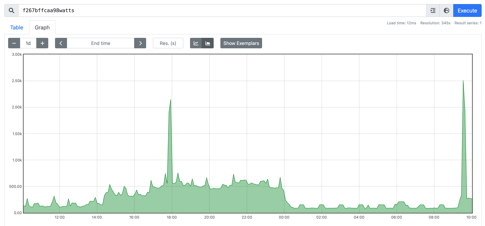

Domestic electricity meter pulse counter consisting of a Bluetooth Arduino device and a listening service running on a Raspberry PI.

Publishes the current consumption in Watts onto a MQTT channel.

## Background

UK domestic electricity meters typically have an LED on the outside of case which pulses as energy is consumed (800 pules per KWh in this case).
This gives a non invasive way to read from the meter.

Counting these pulses and the gaps between them gives a very reliable and fairly low latency estimate of current usage.
This knowledge can be used to track down unexpected high usage.

## Method
 
I'm using a Bluetooth enabled Arduino board with light sensitive diode attached to it.

I've used a commercial sensor designed specifically for this propose. 
The one listed below works on 3.3V and seems to give a good sharp digital single (it probably contains a Schmitt trigger)

There are no power outlets near the meter so the board is battery powered.
The Arduino has a LiPo battery connection and can charge it from USB 5V.

The nRF52 chip has a lower power mode which lets it send Bluetooth Low Energy pings even when Arduino code is not running.
Having the Arduino idle for the majority of the time means that the battery lasts along time between charges (8 weeks).

The nRF52 is configured to pretend that it's a Bluetooth beacon. A Bluetooth beach is allowed to include several bytes of payload in
it's pings.
We'll use a custom encoding to transmit the current pulse count and the time since the last ping in the Bluetooth pings.

The Arduino code maintains a count of pulses seen. 
On power up it sets this to zero and immediately sleeps.

The pulse sensor is wired to one of the interrupt line of the Arduino (major 8 bit / C64 throw back here).
When a pulse is detected the Arduino is drops out of it's delap / sleep loop and executes the interrupt routine.

This increments the counter and rencodes the Bluetooth ping payload.
The nRF52 resumes pinging with new payload and the Arduino resumes sleeping.

A Raspberry PI else where in the building listens for pings from the specific Bluetooth device, decodes the payload of
the packets and publishes it to a MQTT channel. 

This data ends up on a display and in a Prometheus time series.

## Components

- [Adafruit Feather nRF52 Bluefruit LE](https://www.adafruit.com/product/3406)

- Optical Pulse counter
[Optical pulse sensor](https://shop.openenergymonitor.com/optical-utility-meter-led-pulse-sensor/) 

- Raspberry Pi with USB Bluetooth dongle

